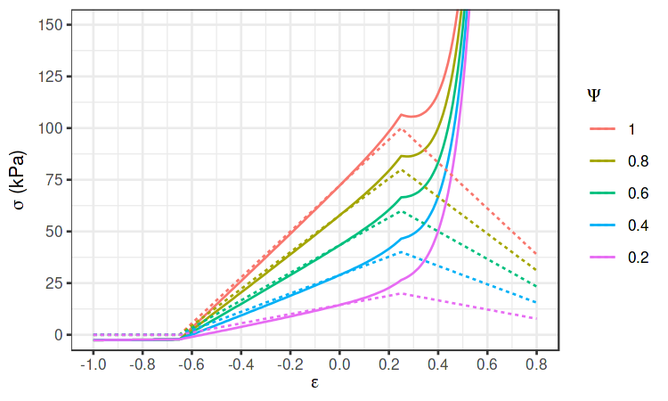
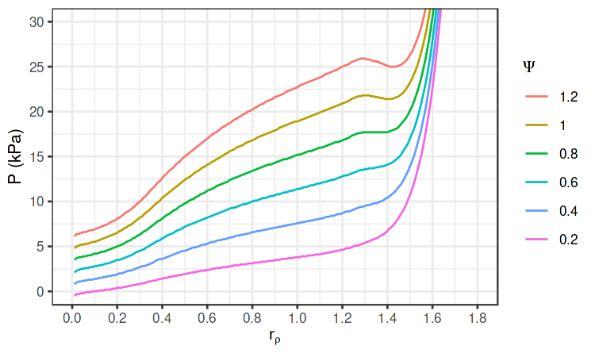
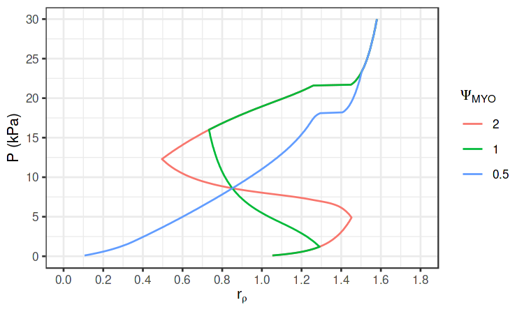

This model extends the original autoregulatory model presented by [Feldberg et al.](http://www.ncbi.nlm.nih.gov/pubmed/7485545), adding an explicit glomerulus and calculating model SNGFR in addition to afferent flow.

The source code is [available](https://github.com/robmoss/model-aa-autoreg) under the BSD 3-Clause license.

## Overview

The original model comprised only an afferent arteriole (AA) and an efferent arteriole (EA), with the hydrostatic pressure defined at the start of the AA (the *inflow* pressure) and the end of the EA (the *venous return* pressure).
The glomerulus was treated only as a single spatial point, at the junction of the AA and EA segments.
This meant that once the resistance of each AA segments was known, the pressure drop along the entire model could be directly obtained (the EA was assumed to have a constant resistance).

We added an explicit glomerular capillary bed (GC), of unit length and constant resistance, whose membrane is permeable to water and solutes.
There is a pressure gradient across the membrane which drives filtration.
The single-nephron glomerular filtration rate (SNGFR) is the rate at which plasma is filtered from the GC into Bowman's capsule.

The flow rate in the GC decreases as a function of distance from the AA, in response to this filtration.
This change in flow rate affects the pressure drop along the GC, and the filtration pressure gradient.

Accordingly, once the resistance of each AA segment is known we need to *solve* for the hydrostatic pressure at the start of the GC, such that the pressure drop across the system equals the difference between the *inflow* and *venous return* pressures.
Once this pressure is known, we can then calculate the flow rate and pressure *everywhere* in the model.

## Equations

In the updated model, there is an explicit pressure profile along the glomerular capillary bed and glomerular filtration is accounted for.
The initial hydrostatic pressure \\(P_G(0)\\), blood flow \\(B_G(0)\\), and plasma flow \\(Q_G(0)\\) depend upon the afferent blood flow \\(B_{AA}\\) and resistance \\(R_{AA}\\) and the plasma hematocrit \\(H_{ct}\\):

\\[\begin{align}
  P_G(0) &= P_{Art} - B_{AA} \times R_{AA} \cr
  B_G(0) &= B_{AA} \cr
  Q_G(0) &= B_G(0) \times (1 - H_{ct}) \cr
\end{align}\\]

From these glomerular inflows we can calculate the SNGFR and efferent blood flow \\(B_G(1)\\), given the glomerular resistance \\(R_G\\), filtration coefficient \\(K_f\\), and oncotic pressure \\(\Pi(x)\\):

\\[\begin{align}
  P_G(1) &= \int_0^1 - B_{G}(x) \times R_G\,dx \cr
  Q_G(1) &= \int_0^1 - K_f \times (P_G(x) - \Pi(x) - P_{BC})\,dx \cr
  B_G(x) &= B_G(0) - (Q_G(0) - Q_G(x)) \cr
  \text{SNGFR} &= Q_G(0) - Q_G(1)
\end{align}\\]

Oncotic pressure is defined as a cubic function of plasma protein
concentration \\(C_p(x)\\):

\\[\begin{align}
  \Pi(x) &= 2.1 \cdot C_p(x) + 0.16 \cdot \left[ C_p(x) \right]^2
    + 0.009 \cdot \left[ C_p(x) \right]^3 \cr
  C_p(x) &= C_p(0) \times \frac{Q_G(0)}{Q_G(x)} \cr
  C_p(0) &= 5.5 \text{ (plasma protein concentration, g/dL)}
\end{align}\\]

## Solver

In order to obtain a solution to these equations, we need to find the value of \\(P_G(0)\\) for which *conservation of energy* is preserved:

\\[\begin{align}
  0 &= P_G(1) - P_V - B_G(1) \times R_{EA}
\end{align}\\]

That is, for the correct value of \\(P_G(0)\\) the pressure drop across the EA as determined by the pressure profile \\((P_G(1) - P_V)\\) will equal the pressure drop across the EA as determined by the efferent blood flow rate \\((B_G(1) \times R_{EA})\\).

Given the net afferent resistance \\(R_{AA}\\), a solution for \\(P_G(0)\\) is obtained using a [bisection method](https://github.com/robmoss/model-aa-autoreg/blob/master/src/model_glom.f90#L208-L287).
This determines the hydrostatic pressure and flow rate at every spatial location in the model.
The muscle activation of each AA segment can then be updated and a new value for the inner radius of each AA segment is obtained.
The net afferent resistance is updated accordingly, and \\(P_G(0)\\) can again be solved.

This [iterative process](https://github.com/robmoss/model-aa-autoreg/blob/master/src/model_glom.f90#L289-L401) begins with the normalised inner radius of each segment set to 1, and is repeated until the relative change in inner radius is less than \\(10^{-8}\\).

## Figures

The following figures demonstrate that this implementation can reproduce the results presented in [the original manuscript](http://www.ncbi.nlm.nih.gov/pubmed/7485545).

/// caption
<strong>Figure 1:</strong> The relationship between stress \\(\sigma\\) and strain \\(\varepsilon\\), for varying levels of muscle activation \\(\Psi\\).
Solid lines show net stress \\(\sigma_e + \sigma_a\\) and dashed lines show active stress \\(\sigma_a\\).
///

/// caption
<strong>Figure 2:</strong> The relationship between transmural pressure \\(P\\) and normalised inner radius \\(r_P\\), for varying levels of muscle activation \\(\Psi\\).
///

/// caption
<strong>Figure 3:</strong> The relationship between transmural pressure \\(P\\) and normalised inner radius \\(r_P\\), for three myogenic responses \\(\Psi_{MYO}(P)\\) with different slopes.
///
